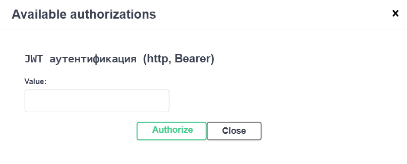
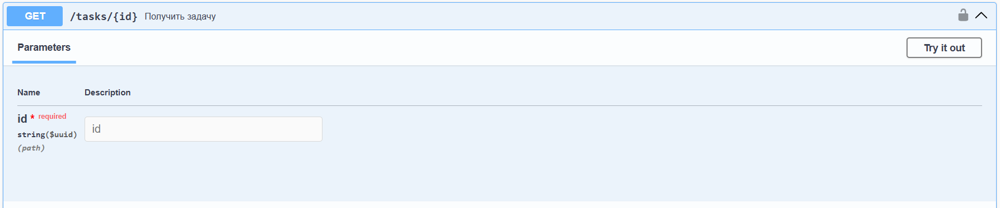

# Сервис управления задачами
## Роли пользователей
### Администратор
- `Создание, редактирование, удаление и просмотр задач, комментариев, исполнений`
- `Назначение исполнителей на задачи`
- `Просмотр и удаление пользователей по их идентификаторам`
### Клиент
- `Просмотр и изменение статуса задач, назначенных администратором`
- `Просмотр исполнителей задач, назначенных администратором`
- `Просмотр информации о задачах, назначенных администратором`
- `Создание, редактирование, удаление и просмотр комментариев к задачам`
## Тестовые данные
### Пользователи
| Имя   | UUID                                 | Почта         | Пароль | Роль          | Имя   | Фамилия |
|-------|--------------------------------------|---------------|--------|---------------|-------|---------|
| admin | 9e976257-f60b-418e-ae39-e34bb78d9e58 | admin@mail.ru | admin  | Администратор | Admin | Adminov |
| user1 | 7b2f2680-556b-4bcd-96e7-344c9c6658d7 | user1@mail.ru | user1  | Клиент        | Jane  | Doe     |
| user2 | 094c52a9-8146-415e-882b-5156308ee6fb | user2@mail.ru | user2  | Клиент        | Max   | Toy     |
> В базе данных пароли представлены в зашифрованном виде (BCrypt шифрование)
### Задачи
| UUID                                 | Заголовок  | Описание                      | Приоритет | Автор | Исполнители  |
|--------------------------------------|------------|-------------------------------|-----------|-------|--------------|
| fd505668-3311-4094-817b-0c44660bb2ca | Basic task | This is just a default task   | LOW       | admin | user1        |
| a74bc275-25e0-4102-b790-a5817b248706 | Cool task  | This task better then default | MIDDLE    | admin | user1, user2 |
| 1b1d4956-92c1-4d2d-87d4-7722adb310a1 | Best task  | Best task ever                | HIGH      | admin | user1, user2 |
### Комментарии
| UUID                                 | Заголовок  | Содержание                     | UUID задачи                          | Автор |
|--------------------------------------|------------|--------------------------------|--------------------------------------|-------|
| a979690a-0dc4-4d9f-84d4-fb182b30bd46 | My opinion | This task is bullshit          | fd505668-3311-4094-817b-0c44660bb2ca | user1 |
| bf4e2b91-6629-4a18-a934-151af0bc52e7 | Wow        | Im impressed how hard it is    | a74bc275-25e0-4102-b790-a5817b248706 | user2 |
| 2ee5d228-cc49-4f3a-9a7a-d8035a618ce6 | Hmm        | My friend stuck with this task | a74bc275-25e0-4102-b790-a5817b248706 | user1 |
## Авторизация
- Чтобы авторизовать пользователя в системе необходимо использовать эндпоинты `/auth/register` для регистрации и `/auth/login` для авторизации
- В ответном сообщении будет находится `JWT-токен`, который используется для доступа ко всем ресурсам

<br>
## Swagger UI
- Чтобы корректно использовать API сервиса используйте `Swagger UI`, настроенный для него
- UI расположен по адресу `http://localhost:9000/api/v1/swagger-ui`
- Все эндпоинты и схема данных документированы. Подробно описаны серверные ответы и обработчики исключений

<br>
## Инструкция к запуску

1. Установите Docker Desktop на свой ПК (для daemon-а) https://docs.docker.com/desktop/setup/install/windows-install/
2. Установите и запустите `git bash`
3. Клонируйте репозиторий в желаемую папку

```shell
cd ${папка, где будет находится проект}
git clone https://github.com/duahifnv/task-management-api.git
cd task-management-api
```

4. Проверьте, что docker daemon запущен

```shell
docker --version
```

5. Запустите скрипт для локального деплоя приложения

```shell
sh run.sh
```

>Запуск займет некоторое время, т.к. будут подгружаться необходимые образы. 
> При успешном запуске откроется страница с Swagger UI по адресу `http://localhost:9000/api/v1/swagger-ui`
